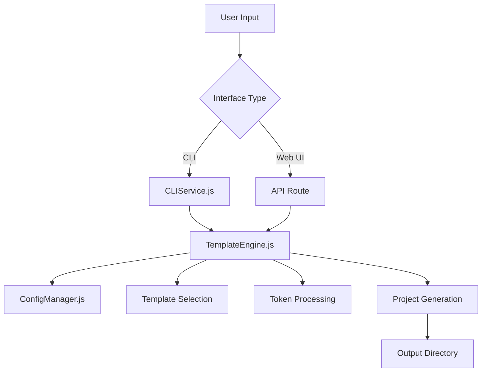

# System Architecture & How It Works

## Overview

The Template Engine Core is designed as a modular, extensible system that separates concerns between template management, configuration handling, and project generation. This document provides a deep dive into how the system works internally.

## Core Architecture

### High-Level Flow



### Component Breakdown

#### 1. **Input Layer**
- **CLI Interface**: Interactive prompts and command-line arguments
- **Web UI**: React-based form interface with visual previews
- **Configuration Files**: JSON-based configuration for automation

#### 2. **Processing Layer**
- **TemplateEngine.js**: Core orchestration logic
- **ConfigManager.js**: Configuration validation and template management
- **Token System**: Dynamic content replacement engine

#### 3. **Output Layer**
- **File System Operations**: Project generation and file manipulation
- **ZIP Creation**: Optional project packaging
- **Download Management**: Web UI download handling

## Detailed System Workflow

### 1. Configuration Processing

```javascript
// User Configuration Input
{
  "sitename": "TechFlow Pro",
  "templateMode": "single",
  "singleTemplate": "template1",
  "designToken": {
    "primaryColor": "#3B82F6",
    "secondaryColor": "#10B981",
    "font": "Inter"
  }
}

// Internal Processing
ConfigManager.validateUserConfig() → 
ConfigManager.getTokenMappings() →
TemplateEngine.initialize()
```

### 2. Template Selection & Copying

```javascript
// Single Mode Flow
if (config.templateMode === 'single') {
  baseTemplate = config.singleTemplate;
  // Copy entire template directory
  fs.copy(templatePath, outputPath);
}

// Mixed Mode Flow
if (config.templateMode === 'mixed') {
  baseTemplate = config.templates.homepage;
  // Copy base template
  fs.copy(baseTemplatePath, outputPath);
  // Overlay specific pages
  applyMixedTemplates();
}
```

### 3. Homepage Routing Setup

```javascript
// Homepage Routing Strategy
async setupHomepage(config, outputPath, baseTemplate) {
  // In mixed mode, handle different homepage templates
  if (config.templateMode === 'mixed') {
    const homepageTemplate = config.templates.homepage;
    if (homepageTemplate !== baseTemplate) {
      // Copy different homepage template to root
      const sourcePagePath = path.join(templateDir, `${homepageTemplate}-project/src/app/page.js`);
      const targetPagePath = path.join(outputPath, 'src/app/page.js');
      await fs.copy(sourcePagePath, targetPagePath);
    }
  }
  
  // Cleanup old /home directories
  const homePageDirPath = path.join(outputPath, 'src/app/(pages)/home');
  if (await fs.pathExists(homePageDirPath)) {
    await fs.remove(homePageDirPath);
  }
}
```

### 4. Token Replacement Engine

```javascript
// Token Processing Pipeline
async applyTokenReplacements(projectPath, config) {
  // Recursive directory processing
  async function processDirectory(dirPath) {
    const items = await fs.readdir(dirPath);
    
    for (const item of items) {
      const fullPath = path.join(dirPath, item);
      const stat = await fs.stat(fullPath);
      
      if (stat.isDirectory()) {
        // Skip node_modules, .next, etc.
        if (!excludedDirs.includes(item)) {
          await processDirectory(fullPath);
        }
      } else {
        await processFile(fullPath);
      }
    }
  }

  // File processing
  async function processFile(filePath) {
    const ext = path.extname(filePath);
    if (!textFileExtensions.includes(ext)) return;

    let content = await fs.readFile(filePath, 'utf8');
    let modified = false;

    // Apply all token replacements
    for (const [token, getValue] of Object.entries(tokenMappings)) {
      const value = getValue(config);
      if (content.includes(token)) {
        content = content.replace(new RegExp(token, 'g'), value);
        modified = true;
      }
    }

    if (modified) {
      await fs.writeFile(filePath, content, 'utf8');
    }
  }
}
```

## Template System Deep Dive

### Template Structure Standards

Each template follows a strict directory structure:

```
template-name-project/
├── src/app/
│   ├── page.js              # Homepage content (root route)
│   ├── layout.js            # App layout wrapper
│   ├── globals.css          # Global styles with tokens
│   └── (pages)/             # Route groups
│       ├── product/page.js  # Product page
│       └── about/page.js    # About page
├── components/              # Reusable UI components
│   └── ui/                  # Base UI components
├── context/                 # React context providers
├── lib/                     # Utility functions
├── locales/                 # i18n translations
├── public/                  # Static assets
├── package.json             # Dependencies & scripts
├── next.config.mjs          # Next.js configuration
├── tailwind.config.ts       # Tailwind CSS config
└── postcss.config.mjs       # PostCSS configuration
```

### Token Integration Points

Tokens are strategically placed throughout template files:

#### 1. **Component Files**
```javascript
// In React components
<h1 className="text-6xl font-bold text-{{PRIMARY_COLOR}}">
  {{SITENAME}}
</h1>
```

#### 2. **CSS Files**
```css
/* In global styles */
:root {
  --primary-color: {{PRIMARY_COLOR}};
  --secondary-color: {{SECONDARY_COLOR}};
  --font-family: {{FONT_FAMILY}};
}
```

#### 3. **Configuration Files**
```json
// In package.json
{
  "name": "{{SITENAME_SLUG}}",
  "description": "{{SITENAME}} - Generated project"
}
```

#### 4. **Metadata Files**
```javascript
// In layout.js
export const metadata = {
  title: '{{SITENAME}}',
  description: '{{SITENAME}} - Professional web application',
  icons: {
    icon: '{{ICON_URL}}'
  }
}
```

## Design Token System

### Token Definition Schema

```javascript
// tokens.json structure
{
  "{{TOKEN_NAME}}": {
    "description": "Human-readable description",
    "getValue": "JavaScript function as string",
    "type": "string|color|url|number",
    "required": true|false,
    "defaultValue": "fallback value"
  }
}
```

### Token Resolution Process

1. **Token Discovery**: Scan all template files for token patterns
2. **Function Compilation**: Convert string functions to executable code
3. **Value Resolution**: Execute functions with user configuration
4. **Pattern Replacement**: Replace all token occurrences
5. **File Writing**: Save modified files to output directory

### Supported Token Types

| Type | Pattern | Example | Use Case |
|------|---------|---------|----------|
| String | `{{SITENAME}}` | "TechFlow Pro" | Site names, text content |
| Color | `{{PRIMARY_COLOR}}` | "#3B82F6" | CSS colors, theme values |
| URL | `{{ICON_URL}}` | "/favicon.ico" | Asset paths, links |
| Slug | `{{SITENAME_SLUG}}` | "techflow-pro" | File names, IDs |

## Error Handling & Validation

### Configuration Validation

```javascript
async validateUserConfig(config) {
  const errors = [];
  
  // Required fields validation
  if (!config.sitename) errors.push('sitename is required');
  if (!config.templateMode) errors.push('templateMode is required');
  
  // Template mode specific validation
  if (config.templateMode === 'single') {
    if (!config.singleTemplate) errors.push('singleTemplate is required');
    if (!availableTemplates.includes(config.singleTemplate)) {
      errors.push('Invalid template name');
    }
  }
  
  // Design token validation
  if (!config.designToken?.primaryColor) {
    errors.push('Primary color is required');
  }
  
  return {
    isValid: errors.length === 0,
    errors
  };
}
```

### File Operation Safety

```javascript
// Safe file operations with error handling
async function safeFileCopy(source, destination) {
  try {
    await fs.ensureDir(path.dirname(destination));
    await fs.copy(source, destination);
  } catch (error) {
    console.error(`Failed to copy ${source} to ${destination}:`, error);
    throw new Error(`File operation failed: ${error.message}`);
  }
}
```

## Performance Considerations

### Optimization Strategies

1. **Lazy Loading**: Templates loaded only when needed
2. **Parallel Processing**: File operations executed concurrently where possible
3. **Memory Management**: Large files processed in streams
4. **Caching**: Configuration and template metadata cached

### Scalability Features

1. **Modular Templates**: Easy to add new templates without core changes
2. **Extensible Tokens**: New token types can be added via configuration
3. **Plugin Architecture**: Custom processors can be added
4. **API Integration**: Web UI provides RESTful API for external integration

## Security Considerations

### Input Sanitization

```javascript
// Sanitize user input to prevent path traversal
function sanitizePath(userPath) {
  return path.normalize(userPath).replace(/^(\.\.[\/\\])+/, '');
}

// Validate template names against whitelist
function validateTemplateName(templateName) {
  const allowedTemplates = ['template1', 'template2', 'template3'];
  return allowedTemplates.includes(templateName);
}
```

### File System Protection

- Template access restricted to defined directories
- Output paths validated to prevent system file overwriting
- User input sanitized to prevent injection attacks
- File operations use safe, absolute paths

## Extension Points

### Adding New Templates

1. Create template directory in `templates/`
2. Follow template structure standards
3. Add template definition to `templates.json`
4. Test with both single and mixed modes

### Adding New Tokens

1. Define token in `tokens.json`
2. Add token patterns to template files
3. Implement getValue function
4. Update configuration schema if needed

### Custom Processors

```javascript
// Example custom processor
class CustomProcessor {
  async process(filePath, config) {
    // Custom processing logic
  }
  
  supports(filePath) {
    // Return true if this processor handles the file
  }
}
```

This architecture ensures the system remains maintainable, extensible, and performant while providing a great user experience across both CLI and web interfaces.
